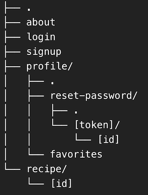
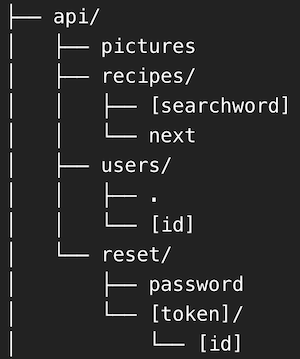

<h1>THE RECIPES WEBSITE</h1>

This <a href="https://the-recipes-website.netlify.app/">website</a> was developed in <a href="https://nextjs.org/">Next.js</a> with typescript to browse recipes from a public API, 
create an account and save your favorite recipes in it.

Created and developed by Manuel Fé Santos.

Check out my other projects on my <a href="https://www.github.com/manuelfesantos">GitHub</a> account.

Check my profile on <a href="https://www.linkedin.com/in/manuelfesantos">LinkedIn</a>.

<h2>How does it work?</h2>

<h3>Recipe Search</h3>

It uses <a href="https://www.edamam.com/">Edamam API</a> to fetch recipes based on keyword search and 
<a href="https://www.justtherecipe.com/">JustTheRecipe</a> to get the recipe's preparation steps.

<h3>Login and Sign Up</h3>

It uses <a href="https://www.mongodb.com/atlas">MongoDB Atlas</a> to store user data, <a href="https://www.npmjs.com/package/bcrypt">Bcrypt</a> to encrypt passwords,
<a href="https://sendgrid.com/en-us">SendGrid</a> to send password recovery emails, Next's API pages to handle
HTTP requests/responses on the backend and Next's pages for a Server-Side Rendered (SSR) frontend.

<h3>User Profile</h3>

It uses <a href="https://www.cloudflare.com/en-gb/developer-platform/r2/">Cloudflare R2</a> to store, access and update 
user profile pictures. This page also provides access to the favorites page where the favorite recipes will be shown.

<h3>Saving Favorite Recipes</h3>

It uses MongoDB to save the favorite recipes for each user and Edamam API to list them in the favorites page.

<h2>Architecture</h2>

<h3>Frontend Endpoints</h3>

<h3>Backend Endpoints</h3>

<h3>Folder Structure</h3>

<h4>The source folder is divided in 5 folders:</h4>

<h5>Pages:</h5>

SSR components used by the Pages Router to render components into the html page.

<h5>Components:</h5>

Reusable components that enable the website's responsiveness and modularity

<h5>Styles:</h5>

CSS modules that style each component, based on global variables defined in globals.css

<h5>Types:</h5>

Types that are shared between all components, utils and pages to ensure a type compatibility between the whole project.

<h5>Utils:</h5>

Utility files that allow connection to external services. 
These integrate all the external systems stated above.
